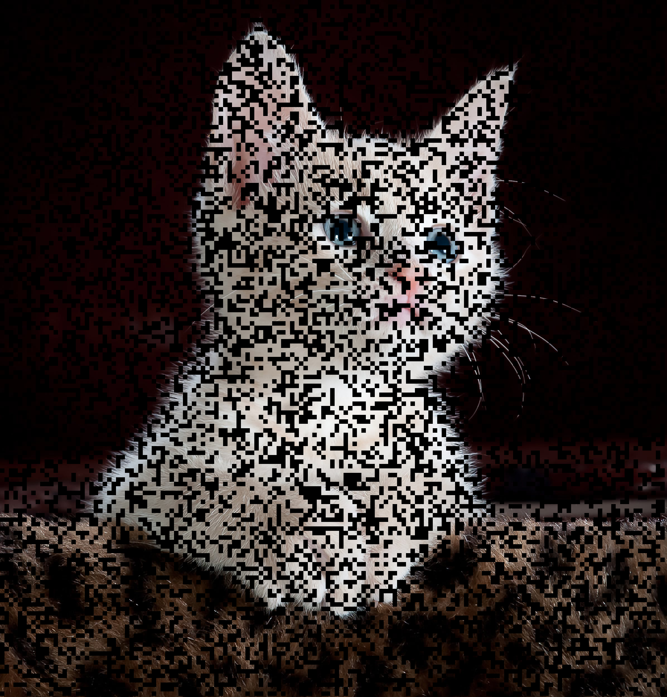

# Fast-mask

## Build
```bash
git clone https://github.com/shadawck/fast-mask && cd fast-mask
cargo build --release
```

## or install localy
```bash
cargo install --path .
```


## Example :
```bash
wget https://github.com/fferlito/Cat-faces-dataset/raw/master/dataset-part1.tar.gz
tar xvf dataset-part1.tar.gz

# Process folder
fast-mask --ratio 0.2 --patch-size 8 -i ./dataset-part1 --output output
> [00:02:05] [████████████████████████████████████████] 10000/10000


# Process one image
fast-mask --ratio 0.2 --patch-size 8 -i ./dataset-part1/cat_0.png --output .
> [00:00:00] [████████████████████████████████████████] 1/1  
```

|       raw image         |  patch image (r = 0.4, p = 16) |
|-------------------------|--------------------------------|
|        |   |


